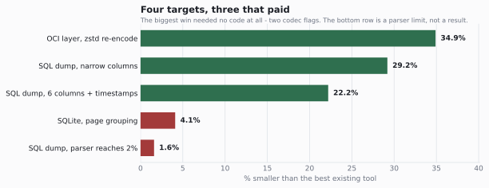

# sql-compression

**Byte-lossless transforms that beat general-purpose compressors on SQL-shaped data,
by exploiting the shape of the format instead of building a better model.**

A SQL dump stores rows. That means a timestamp sits beside a title beside an integer —
three different distributions interleaved, which is the worst case for any entropy coder.
Regrouping the bytes column-major so like sits with like, then re-spelling the values that
are written in a wasteful notation, gets **23–30% below `xz -9`** while reproducing the
input byte for byte.

The method matters more than the transforms: **measure the incumbent before inventing.**
`baseline.py` runs five stock codecs against a target *before* any transform is written, so
the question is always "what is left to win?" rather than "did my idea help?". Two of the
four results below were decided by that step alone — one of them without writing any
algorithm at all.



| target | best existing | with this repo | gain | effort |
|---|---:|---:|---:|---|
| **OCI / Docker layer** | 29,780,905 (gzip, as shipped) | **19,383,787** (`zstd -19 --long=27`) | **−34.9%** | **zero code** |
| **SQL dump**, narrow columns | 102,532 (`xz -9`) | **71,768** | **−30.0%** | ~520 lines, lossless |
| **SQL dump**, 6 columns + timestamps | 99,188 (`xz -9`) | **76,552** | **−22.8%** | same code |
| **SQL dump**, multiline article blob | 1,910,312 (`xz -9`) | **1,878,296** | **−1.7%** | same code |
| **SQLite**, page grouping | 2,088,376 (`xz -9`) | 2,077,660 | −0.5% | dead end |

Round-trip is asserted on every run, and a `selfcheck()` covers twelve dump shapes the
sample files do not contain — several of which silently corrupted an earlier version.

---

## The SQL dump transform

`sqldump.py`. Two independent ideas, and the second turned out to be the bigger one.

### 1. Regroup column-major

Rows in, columns out. Non-INSERT lines are kept verbatim, and a plan stream records the
original line order, so `restore()` reproduces the input exactly. Worth **14–18%**.

### 2. Re-spell the values

Decimal ASCII is the worst case for a coder *twice over*, in two ways that want opposite
fixes:

- an **ID column** is a ramp — `3501,3502,3503` shares almost no bytes with its neighbour,
  so the coder re-learns the counter every row. Delta turns it into a column of `1`s.
- a **wide value column** (file sizes, durations) mixes a slow-moving high digit with a
  random low digit in one byte stream. Byte-plane transposition splits them, so the high
  plane compresses hard and the noise is quarantined in the low one.

Neither wins everywhere, and the loser is not close — per column, under `xz -9`:

| column | ASCII | delta | planes | delta+planes |
|---|---:|---:|---:|---:|
| `Track.0` — monotonic id | 1,431 | **45** | 328 | 66 |
| `InvoiceLine.2` | 2,272 | **69** | 1,232 | 112 |
| `Track.7` — file sizes | 13,209 | 13,239 | **10,678** | 11,200 |
| `revision.5` | 9,999 | 11,594 | **8,510** | 9,992 |
| `revision.0` | 2,307 | 828 | 1,663 | **823** |

So the transform **does not predict** which encoding wins. It tries every spelling per
column with a cheap proxy codec and stores the winner in a one-token header. Picking by
rule would have mis-called the columns where they are close — and the proxy was audited
against the real backend on the five heaviest columns and picked the optimum every time.

### 3. The same trick on a string column

An ISO-8601 timestamp — `'2005-12-27T18:46:47Z'` — is 22 bytes spelling a number that fits
in four. Parsing to epoch seconds and reusing the byte-plane path:

| `revision.2` | ASCII | epoch ASCII | epoch delta | epoch planes | epoch delta+planes |
|---|---:|---:|---:|---:|---:|
| xz -9 bytes | 20,824 | 17,812 | 18,848 | **16,092** | 16,816 |

−4,732 bytes, **5.8% of that file's entire output**, moving it from −17.4% to −22.2%.
Losslessness is not assumed: a value must re-render byte-exactly from its epoch integer or
the column falls back. `'0000-99-99T99:99:99Z'` matches the shape and is not a date, so it
fails the gate rather than corrupting — `selfcheck()` asserts exactly that.

### 4. Strip the quotes the header already implies

A uniformly quoted column spends two bytes per row on delimiters that the column's own
position already determines. Stripping them and re-encoding the inside through the same
candidate set is worth **−844 B on chinook** (29.2% → 30.0%), **−660 B on wiki_meta**
(22.2% → 22.8%) and **−1,584 B on wiki.sql**. It also opens a second door: a quoted number
or a quoted timestamp can now reach the integer and epoch paths it was previously locked
out of.

The strip does not recurse. One is the whole idea; a second pass would re-fire on values
that merely happen to begin and end with a quote.

**Cumulative on chinook:** regrouping alone −17.8%, plus integer re-spelling −28.5%, plus
ISO-8601 timestamps −28.6%, plus decimals / SQL datetimes / a NULL bitmap −29.2%, plus the
quote strip −30.0%. wiki_meta runs the same path to −22.8%. Most of the win was in *how
values were spelled*, not where they sat.

---

## The Docker layer needed no invention

A real `python:3.12-slim` layer. Re-encoding the *identical* tar:

| | size | vs shipped |
|---|---:|---:|
| as shipped (gzip) | 29,780,905 | — |
| gzip -9 *(sanity check)* | 29,796,986 | +0.05% |
| bz2 -9 | 25,748,725 | −13.5% |
| zstd -19 | 20,164,715 | −32.3% |
| **zstd -19 `--long=27`** | **19,383,787** | **−34.9%** |
| xz -9 | 17,782,292 | −40.3% |
| xz -9 + x86 BCJ | 17,286,776 | −42.0% |

**Mechanism: gzip's 32 KB window.** The tar is 81 MB across 3,260 members — shared strings
across Python's stdlib, repeated ELF patterns, duplicated headers. A 128 MB window sees all
of it; gzip structurally cannot look past 32 KB. An architectural limit, not a modelling one.

`--long=27` is free in every sense that matters: 27 is the decoder's own default window
limit, so the frame still decodes everywhere and stays the same OCI media type, and it is
*faster* than plain `-19` (25.6 s vs 42.4 s). Going to `-22 --ultra` buys 0.9% more for ~3×
the time — tested, rejected.

`zstd` is already a legal OCI layer media type, so **−34.9% is deployable with a config
change**. `xz` would need a new one, so treat −42.0% as the format-unconstrained ceiling
rather than the offer. This is a **re-encode** — identical tar content, new digest — not a
byte-lossless transform of the shipped blob.

---

## SQLite page grouping is a dead end

`sqlitepages.py` sorts pages by b-tree kind, storing one kind byte per page (the sort is
stable, so the kinds fully determine the permutation). Worth **0.5–4.1%**. The census says
why: `wiki.db` is **2,830 leaf-table pages out of 2,913**, so "group by kind" has one kind
to work with, and freshly built databases have no free pages to gather.

The win would need record-level columnarisation *inside* leaf pages — the same mechanism
that worked on dumps, but behind SQLite's binary record format. See
[NEXT_STEPS.md](NEXT_STEPS.md); it is scoped, and it is days of work with a real corruption
risk that the current test data cannot detect.

---

## What didn't work

Seven refuted predictions with measurements, all in [`results.json`](results.json). The
short version:

| prediction | verdict | measurement |
|---|---|---|
| dictionary-encoding the big string columns will pay | **refuted** | loses on every heavy column: −104 to −764 B |
| front-coding string columns will pay | **refuted** | Track.1 26,744 → 26,900 B |
| RLE on the plan stream is worth writing | **refuted** | saves ≤168 B of a 73 KB output |
| the cheap proxy codec will mis-pick vs real xz | **refuted** | picked the optimum on all 5 heavy columns, 0 B wasted |
| `xz pb=0 lc=4` tuning is worth ~2 points | **true, then not** | 1.9 pts before the value codec, 0.4 after — same problem, fixed properly |
| grouping SQLite pages by kind will help | **refuted** | 0.5–4.1%; real databases are overwhelmingly one kind |
| wiki.sql's −0.1% proves shape decides the win | **cited from a broken instrument, then earned** | 97.7% of the file bypassed the parser. Fixed; 86.4% now reaches it and the gain is still 1.7% — see below |

That last one is the most useful, and it has now closed both ways. `wiki.sql` was cited as
the controlled proof that single-blob-column tables cannot be columnarised, and it wasn't:
only **1,176 of its 68,576 lines** matched the line-based INSERT parser, because SQLite's
`.dump` emits raw newlines inside string values, so 6.8 MB rode through untouched. That
number measured parser coverage, not table shape.

Statement-level parsing fixed the instrument. All **5,065** INSERT statements now parse and
**86.4%** of the file's bytes reach the transform — a 37× increase in coverage — and the
gain moved 0.2% → **1.7%**. So the original claim was right about the conclusion and wrong
about its evidence: on a table whose bytes are one dominant multiline TEXT column, there is
almost nothing for a columnar transform to regroup. It cost a parser rewrite to earn the
verdict the bad measurement had guessed, which is the only way to know which half was
wrong.

**The residual is now model-shaped, not spelling-shaped.** Strings are ~70% of what is left
(`Track.1` alone is ~26.7 KB of chinook's 71,768 bytes), and both obvious cheap
re-spellings lost. The quote strip below is the last cheap byte.

---

## Running it

```bash
pip install -r requirements.txt
python scripts/fetch_data.py     # Docker layer, SQLite dbs, SQL dumps. ~130 MB, one time.

python baseline.py               # measure the incumbents FIRST
python sqldump.py data/chinook.sql       # the 30.0% win, round-trip asserted
python sqldump.py data/wiki_meta.sql     # the 22.8% win
python sqlitepages.py data/wiki.db       # the dead end, for the record
python make_chart.py             # regenerate the chart from results.json
```

`baseline.py` takes an optional target: `sql`, `sqlite`, `oci`, or `all`.

**No test data is committed.** The Docker layer, the third-party sample database and the
Wikipedia-derived tables are other people's content under their own licences, and this repo
is MIT — redistributing them here would be relicensing what isn't ours.
`scripts/fetch_data.py` rebuilds every file, and pins the sample database to a commit SHA
so the headline number stays reproducible.

---

## Files

| file | what |
|---|---|
| `sqldump.py` | the columnar transform + per-column value codec. The main result. |
| `sqlitepages.py` | page-kind grouping. Measured, negative, kept for the record. |
| `baseline.py` | what the stock codecs already achieve. Run this first, always. |
| `results.json` | every measurement. The README quotes it; the chart is generated from it. |
| `scripts/fetch_data.py` | rebuilds the test data. Nothing is committed. |
| `NEXT_STEPS.md` | what is left, costed and ordered. |

---

## Provenance

This began as "Part 2" of [`llm-compression-lab`](https://github.com/BeForce1/llm-compression-lab),
where the other half asks whether a language model can beat general compressors (it can:
0.915 bpb on `alice29.txt`, verified round-trip — and it is far too slow to use). The two
halves share nothing but a method, so they are now separate repos. Git history for these
files is preserved from the original.

The comparison between them is the most useful thing either produced: swapping the language
model was worth **45%**, every hand-built modelling improvement combined was worth about
**1%**, and over here a *codec flag* beat an afternoon of transform code.

## License

MIT — see [LICENSE](LICENSE).
